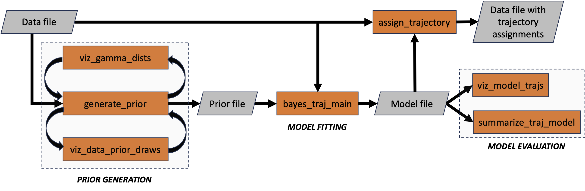

# Statement of need 

Trajectory analysis broadly refers to techniques and modeling paradigms that
explain heterogeneity in longitudinal data. These methods identify
the most suitable number of subgroups (trajectories) in the data, the distinct
patterns of change characterizing each trajectory, and the most likely assignment of
study participants to trajectories. Methods of trajectory analysis have
been applied to a wide range of fields including psychology, criminology,
behavioral research, and epidemiology. (These methods are distinct from those that
track people, animals, vehicles,
and natural phenomena -- also referred to as trajectory analysis -- and which
have their own dedicated set of techniques and frameworks. See, e.g., 
[@shenk2021traja] and [@viera2023pactus]).

Although trajectory analysis has been applied in multiple
domains, the motivation for developing **bayes_traj** has been to improve our
understanding of
heterogeneity in the context of chronic obstructive pulmonary disease (COPD), a
leading cause of death worldwide. Research has shown that there are multiple
patterns of lung function development and decline, with some patterns associated
with greater risk of developing COPD [@lange2015lung]. Furthermore, there
is a growing recognition that COPD is better conceived of as a multi-faceted syndrome,
requiring consideration of other disease facets (such as clinical presentation
and structural assessment from medical images) [@lowe2019copdgene].
Researchers have applied techniques
of trajectory analysis to longitudinal measures of lung function to delineate
distinct patterns of progression for further analysis [@agusti2019lung].
Existing trajectory approaches
are predominantly frequentist in nature and use maximum likelihood to identify point
estimates of unknown parameters. These approaches do not permit incorporation of
prior information.
Challenges arise when study cohorts lack sufficient longitudinal data characteristics
to adequately power frequentist-based trajectory algorithms.
Bayesian approaches are well-suited for data-limited scenarios given their ability
to incorporate prior knowledge in the model fitting process, though existing
Bayesian trajectory approaches
use sampling-based inference (i.e. Markov chain Monte Carlo)
which can be slow to converge and can suffer from the so-called "label switching" problem.
There is thus a need for scalable approaches that can simultaneously model distinct
progression patterns across multiple health measures, especially in data-limited scenarios.

# Summary

**bayes_traj** is a Python package for Bayesian trajectory analysis,
offering a suite of command-line tools for prior specification, model fitting,
and posterior evaluation.
{ width=80% } **(Figure 1)**
illustrates the key tools and their role within the workflow. The package is
domain-agnostic and applicable across various disciplines.
It is particularly suited for researchers who require scalable trajectory analysis
methods, especially in scenarios where traditional frequentist approaches struggle
due to limited data or the need to incorporate prior knowledge. By providing a scalable
Bayesian alternative, **bayes_traj** complements existing tools and broadens
the range of methodologies available for trajectory analysis.

**Figure 1**: Workflow of **bayes_traj** command-line tools (orange). The process begins
with an input **data file**, which informs prior specification using the 
`generate_prior` routine. (`viz_data_prior_draws` and `viz_gamma_dists` provide feedback
for prior evaluation.)
Model fitting (`bayes_traj_main`) take a prior and input data to perform
Bayesian inference. The fitted model is evaluated through visualization
(`viz_model_trajs`) and quantitative summary (`summarize_traj_model`).
Finally, `assign_trajectory` applies the fitted model to assign individuals
to trajectory groups. Each command-line tool
supports the `-h` flag for detailed usage instructions.

**bayes_traj** has several distinguishing features:

- It can simultaneously model multiple continuous and binary target
variables as functions of predictor variables.
- Given an estimate of the number of trajectories, it uses
Bayesian nonparametrics (Dirichlet Process mixture modeling) to automatically
identify the number of groups in a data set. 
- It makes the assumption that target variables are conditionally independent
given trajectory assignments, enabling the algorithm to scale well to multiple
targets.
- Bayesian approximate inference is performed using coordinate ascent variational
inference, which is fast as scales well to large data sets.
- Independently estimates residual variance posteriors for each trajectory and
each target variable
- Allows specification of random effects for continuous target variables using
unstructured covariance matrices
- Provides a suite of tools to facilitate prior specification, model
visualization, and summary statistic computation. 

These features make **bayes_traj** a great fit for investigating COPD
heterogeneity, and we have used it in several publications. In an early
implementation, we used it to identify disease subtypes using five measures
of emphysema computed from medical images [@ross2016bayesian]. Later we used
it to identify distinct lung
function trajectories in one cohort and to then probabilistically assign
individuals in another cohort to their most likely trajectory for further
analysis [@ross2018longitudinal]. Recently, we applied **bayes_traj** to
multiple measures of lung function in a cohort of middle-aged and
older adults, using an informative prior to capture known information
about lung function in early adulthood [@ross2024dysanapsis].

While **bayes_traj** offers several advantages over existing trajectory analysis
tools, it also has some limitations. The underlying model assumes conditional
independence of target variables given trajectory assignments and predictors,
which, although common, may not always hold in real-world data. Additionally,
while variational inference is scalable, provides computational efficiency, and is
less susceptible to label-switching, it may not capture
posterior characteristics as accurately as sampling-based methods. The model also
assumes that errors are uncorrelated, a simplification that may not be appropriate
for all use cases. Finally, although **bayes_traj** supports both continuous and
binary target variables, it does not currently handle count data.

# State of the field

There are numerous approaches to trajectory analysis that make different modeling
assumptions and use different inference strategies, and implementations are available
in R, SAS, Stata, and MpLus.
Van der Nest et al. [@van2020overview], Lu [@lu2024clustering], and
Lu et al. [@lu2023joint] provide excellent reviews of the state of the art.
Two broad and commonly used model-based approaches are group-based trajectory modeling
(GBTM) and latent class mixed effect modeling (LCMM). GBTM assumes identical
trajectories within clusters, while LCMM generalizes this by allowing individual
trajectories to deviate from the cluster mean.
Zang and Max describe a Bayesian group-based trajectory modeling approach
that relies on MCMC for inference with an implementation available in R [@zang2022bayesian].
Other Bayesian approaches
to trajectory analysis such as Bayesian mixture modeling [@komarek2013clustering]
and Bayesian consensus clustering [@lock2013bayesian] have implementations in
R [@komarek2014capabilities, @tan2022bcclong] and fall within the LCMM category.
These methods also rely on MCMC for inference. The model implemented in
**bayes_traj** can be considered a Bayesian nonparametric version of LCMM
that is capable of modeling multiple longitudinal markers.
To our knowledge, **bayes_traj** is the only full-featured Python package for
Bayesian nonparametric trajectory analysis that uses variational inference for
model fitting across multiple target variables, making it a scalable and
versatile tool for researchers across disciplines that complements the collection
of existing trajectory analysis approaches.

# Acknowledgements

Special thanks to Tingting Zhao for developing
variational update equations for inference over binary target variables. Special
thanks also to Fritz Obermeyer for contributing code toward incorporating Pyro
probabilistic programming language capabilities into the **bayes_traj**
environment as part of a subcontract funded through NIH R01-HL164380.
Continued development of **bayes_traj** is supported by the US National Heart,
Lung, and Blood Institute (R01-HL164380).
**bayes_traj** would not be possible without numerous other open-source
Python packages, especially numpy [@harris2020array], scipy [@2020SciPy-NMeth],
matplotlib [@Hunter_2007], PyTorch [@NEURIPS2019_9015], and
pandas [@reback2020pandas]. 

# References